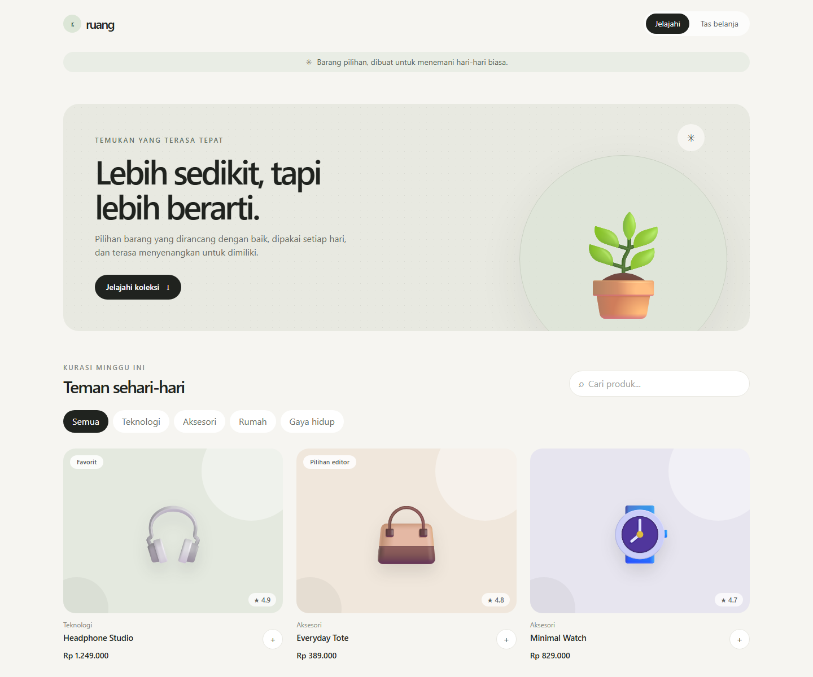
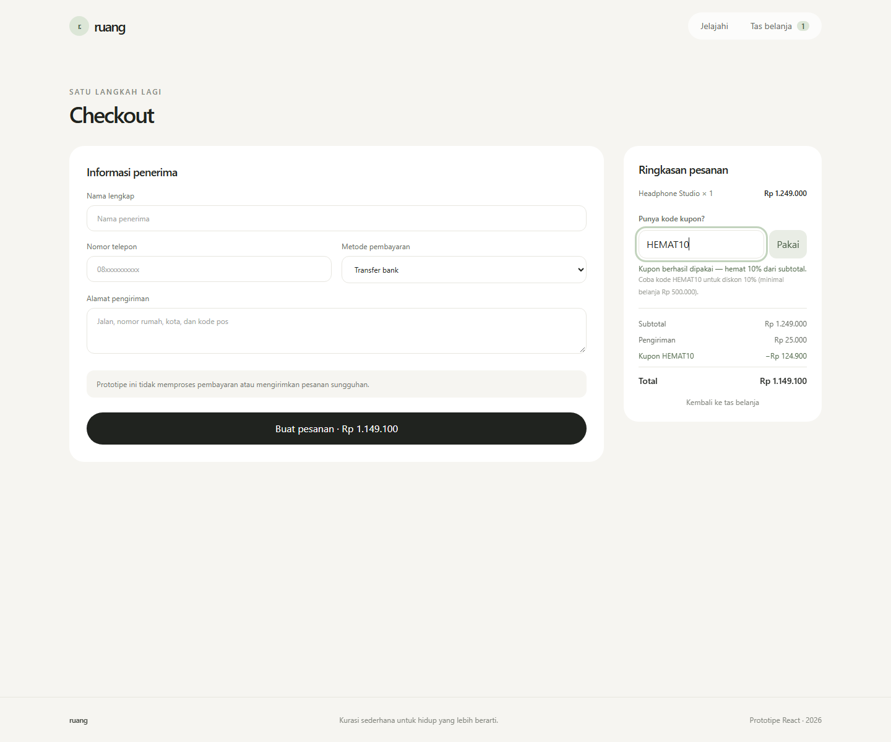

# Laporan Proyek — Ruang E-Commerce

## Ringkasan

Ruang adalah prototipe aplikasi e-commerce satu halaman untuk katalog produk, tas belanja, dan simulasi checkout. Implementasi merujuk pada satu modul proyek, [`BAB II Frontend Programming State Management.pdf`](./docs/BAB%20II%20Frontend%20Programming%20State%20Management.pdf), khususnya bagian React + Vite, Tailwind CSS, React Router, komponen halaman, `useState`, dan Context keranjang.

## Tech stack

- **React 19** untuk membangun antarmuka berbasis komponen.
- **Vite 7** sebagai development server dan build tool.
- **Tailwind CSS 4** melalui plugin `@tailwindcss/vite` untuk styling responsif.
- **React Router 7** untuk navigasi katalog, detail produk, tas belanja, dan checkout.
- **Context API (`createContext` dan `useContext`)** untuk berbagi state keranjang, jumlah barang, dan subtotal tanpa prop drilling.
- **`useState`** untuk filter pencarian/kategori, input rating dan ulasan, form kupon, dan hasil checkout.

## Fitur dan alur

1. **Jelajahi katalog:** lihat produk, cari dengan kata kunci, dan filter menurut kategori.
2. **Detail produk:** lihat deskripsi dan tambahkan ulasan dengan rating.
3. **Tas belanja:** tambahkan barang, ubah kuantitas, hapus barang, dan lihat ringkasan.
4. **Simulasi checkout:** isi nama, nomor telepon, alamat, dan metode pembayaran. Tidak ada pembayaran atau pengiriman sungguhan.
5. **Fitur tambahan — kupon `HEMAT10`:** potongan 10% dari subtotal, berlaku mulai Rp500.000. Kode yang tidak dikenal dan minimum belanja yang belum terpenuhi menampilkan pesan yang jelas.

## Bukti tangkapan layar

Tangkapan layar diambil dari aplikasi yang berjalan secara lokal:

### Beranda dan katalog



### Fitur tambahan — kupon checkout



## Cara menjalankan

Pastikan Node.js dan npm telah tersedia, lalu jalankan:

```bash
npm install
npm run dev
```

Untuk memeriksa build produksi:

```bash
npm run build
npm run preview
```

## Publikasi

- **GitHub Repository URL:** belum tersedia (repository belum dibuat).
- **Publish URL:** belum tersedia (menunggu publikasi ke GitHub Pages).

Workflow GitHub Actions untuk build dan publikasi sudah disiapkan di `.github/workflows/deploy.yml`. Aktifkan GitHub Pages menggunakan sumber **GitHub Actions** setelah source code diunggah.
